<div align="center">

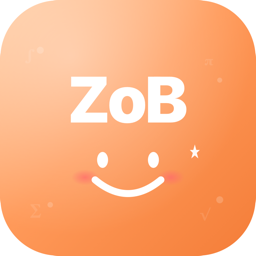

# ZoB ZoB

**12. sınıf matematik · YKS hazırlık · öğretmen–öğrenci akıllı sınıf takibi.**

Native iOS app · SwiftUI · Swift Charts · iOS 17+ · 2026 AYT müfredatı


</div>

<br />

<p align="center">
  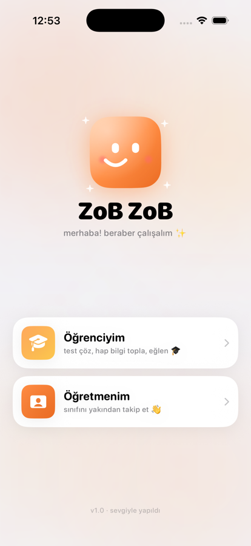
  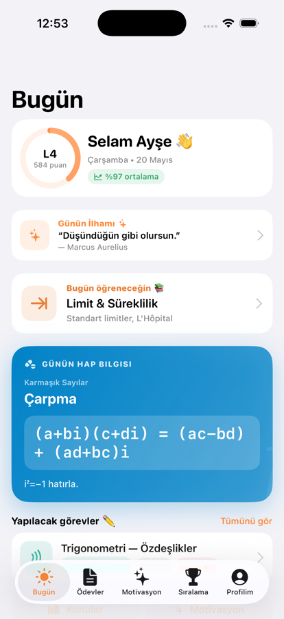
  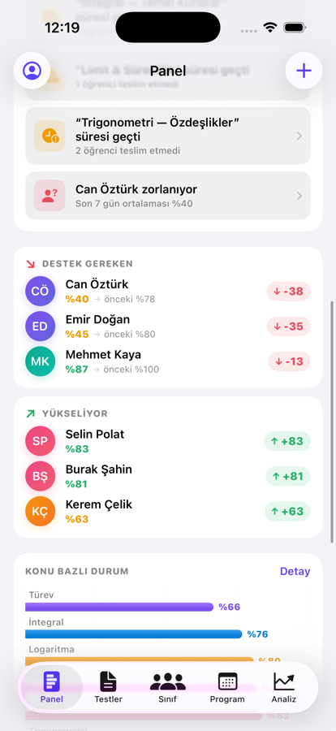
</p>

---

## Niçin ZoB ZoB?

Sınıfta YKS'ye hazırlanan öğretmenler, **her öğrencinin hangi konuda nerede zorlandığını gözle takip edemez**. Klasik ödev sistemleri sadece "kaç doğru" der; ama bir öğrencinin **emin olduğu halde yanılması** ile **tahminle bilmesi** çok farklı şeylerdir.

ZoB ZoB, her cevap için **güven seviyesi + süre + zorluk** verisi toplar; bunu öğretmene **Discrimination Index**, **Calibration ECE**, **outlier tespiti** ve **öğrenci × konu ısı haritası** olarak sunar. Öğrenciye de günlük hap bilgi, motivasyon sözü, rozet ve sıralamayla heyecan katar.

---

## ✨ Öne çıkanlar

<table>
  <tr>
    <td width="50%" valign="top">

### 🎓 Öğrenci tarafı
- **Bugün** — selam mesajı, ilerleme halkası, günün ilhamı, günün konusu, günün hap bilgisi (formül), bekleyen görevler
- **Ödevler** — A–E 5 şıklı sorular, **güven seçimi** (eminim/kararsızım/tahmin), süre ölçümü, %70+'ta konfeti 🎉
- **Motivasyon** — 47 alıntı (matematikçiler, Türk düşünürleri, azim, zihniyet, bilgelik)
- **Sıralama** — podium 🥇🥈🥉 + tam liste
- **Profilim** — Seviye/XP, **Sezgi skoru** (öz-değerlendirme), sparkline ilerleme, 9 rozet
- **Konular kütüphanesi** — 12 konu × 60+ formül, arama + detay modal

    </td>
    <td width="50%" valign="top">

### 👨‍🏫 Öğretmen tarafı
- **Panel** — 4 KPI (sınıf ort., teslim, sezgi, katılım) + delta arrow'ları
- **Otomatik uyarılar** — geçmiş ödev, zayıf konu, zorlanan öğrenci
- **Outlier tespiti** — destek gereken + yükseliyor öğrenciler
- **Analiz** — Swift Charts ile:
  - Sınıf yörüngesi (line + area)
  - Teslim hızı (bar)
  - Konu bazlı başarı
  - Güven sezgisi (calibration scatter + ECE)
  - Zorluk vs gerçek başarı (scatter)
  - **Öğrenci × Konu ısı haritası**
  - Soru bazlı **Discrimination Index** sıralaması
- **Haftalık konu programı** + **test editörü**

    </td>
  </tr>
</table>

---

## 📸 Ekran turu

### Öğrenci

<p align="center">
  
  
  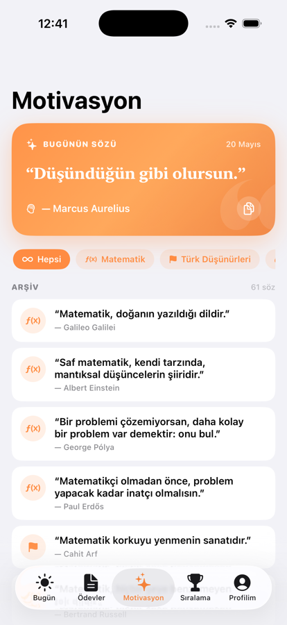
  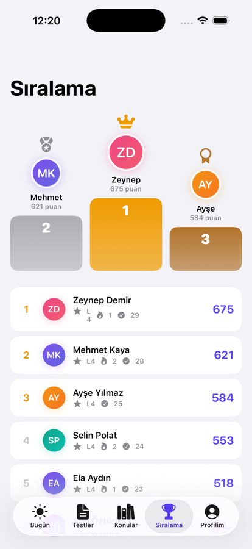
</p>

<p align="center">
  <em>Welcome (animasyonlu mascot) · Bugün · Motivasyon · Sıralama</em>
</p>

<p align="center">
  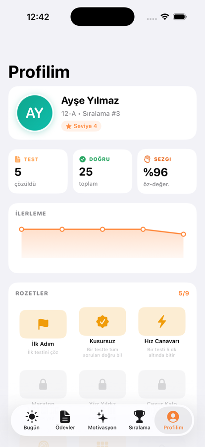
</p>

<p align="center">
  <em>Profilim — Sezgi skoru, ilerleme sparkline'ı, rozetler</em>
</p>

### Öğretmen

<p align="center">
  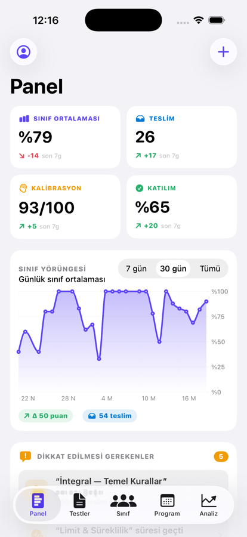
  
  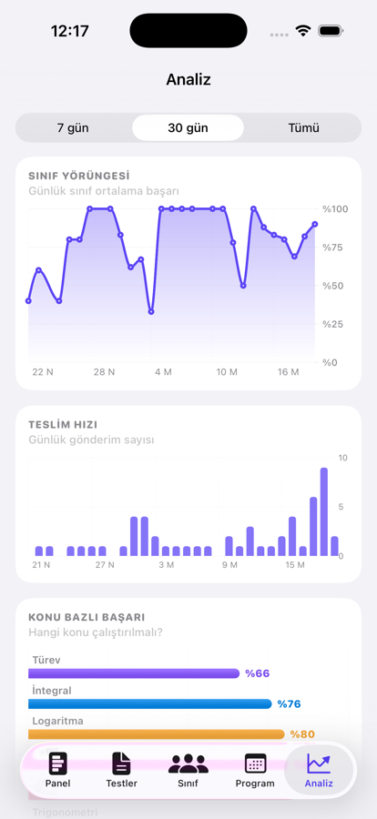
</p>

<p align="center">
  <em>Panel (KPI + günlük yörünge) · Otomatik uyarılar + outlier · Analiz (Swift Charts)</em>
</p>

<p align="center">
  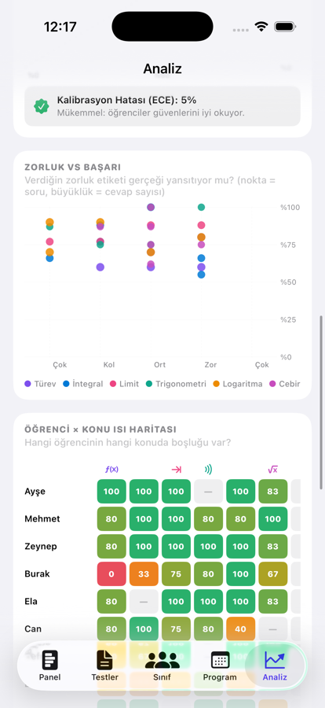
  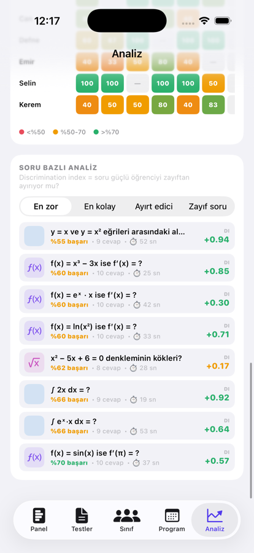
</p>

<p align="center">
  <em>Güven kalibrasyonu + öğrenci × konu ısı haritası · Soru bazlı DI sıralaması</em>
</p>

---

## 🧠 Veri ve psikometri

Her cevap için 4 sinyal toplanır:

```
choiceIndex    →  A–E hangi şıkkı seçti
timeMs         →  o soruda kaç ms harcadı
confidence     →  eminim / kararsızım / tahmin
```

Bunlardan türetilen metrikler:

| Metrik | Hesap | Ne işe yarar? |
|---|---|---|
| **Sezgi (calibration)** | Stated confidence vs actual accuracy, ECE ile | Aşırı güvenli mi? Tahmin yapıyor mu? |
| **Discrimination Index (DI)** | Sorudaki başarı ile testteki genel başarının Pearson korelasyonu | Soru, güçlü öğrenciyi zayıftan ayırabiliyor mu? |
| **Outlier deltası** | Son 7 gün ortalaması vs önceki 7 gün | Kim düşüyor? Kim yükseliyor? |
| **Konu × öğrenci ısı haritası** | Her hücre = o öğrencinin o konudaki başarısı | Kişiselleştirilmiş zayıflık haritası |
| **Zorluk kalibrasyonu** | Öğretmenin verdiği zorluk vs gerçek başarı (scatter) | Senin "zor" dediğin gerçekten zor mu? |

---

## 📚 Konular (2026 AYT müfredatı)

| Konu | Sınav | Formül sayısı |
|---|---|---|
| Türev | AYT | 12 |
| İntegral | AYT | 11 |
| Limit & Süreklilik | AYT | 6 |
| Trigonometri | AYT | 8 |
| Üstel & Logaritma | AYT | 6 |
| Diziler | AYT | 6 |
| Polinomlar | AYT | 8 |
| Karmaşık Sayılar | AYT | 7 |
| Olasılık & Sayma | TYT & AYT | 5 |
| Fonksiyonlar | TYT & AYT | 4 |
| Analitik Geometri | AYT | 8 |
| Geometri | TYT & AYT | 6 |

Kaynaklar: [MEB 12. sınıf müfredatı](https://www.bilgenc.com/12-sinif-matematik-konulari/), [2026 AYT](https://www.osymli.com/yks/ayt-matematik-konulari.html).

---

## 🏗 Mimari

```
Sources/Sinav/
├── SinavApp.swift              # @main + ContentView (rol router)
├── Models/Models.swift         # Codable: Topic, Student, Test, Question, Submission, …
├── Theme/Theme.swift           # Renkler, font, haptics, tarih helper'ları
├── Data/
│   ├── Pills.swift             # 60+ formül bankası (konuya göre)
│   ├── Motivation.swift        # 47 motivasyon alıntısı
│   └── SampleData.swift        # 30 günlük sentetik teslimler (seeded RNG, gerçekçi profiller)
├── Store/
│   ├── AppStore.swift          # @Observable, JSON dosya kalıcılık
│   └── Analytics.swift         # KPI, kalibrasyon, DI, outlier, heatmap
├── Components/
│   ├── Components.swift        # Avatar, BadgePill, StatCard, ProgressRing, Sparkline, …
│   ├── Charts.swift            # Swift Charts components (line, bar, scatter, heatmap, KPI delta)
│   └── Mascot.swift            # ZobMascot + sparkles + confetti
├── Welcome/WelcomeView.swift
├── Student/   # 8 view (Tab, Today, Tests, Library, Leaderboard, Profile, TakeTest, Result, Motivation)
└── Teacher/   # 8 view (Tab, Dashboard, Tests, Editor, Detail, Class, StudentDetail, Program, Insights)
```

**State yönetimi:** `@Observable` (iOS 17+) AppStore singleton, dependency injection `.environment(store)` ile. Persistans → `Documents/zobzob-state.json`.

**Navigasyon:** `TabView` (5 tab) + `NavigationStack` + `sheet(presentationDetents)` modal'ları.

**Native modern API'ler:** `.sensoryFeedback`, `.symbolEffect`, `.contentTransition(.numericText())`, `Chart { }` (Swift Charts), grouped `Form`/`List`, `.searchable`, `.refreshable`, safe areas.

---

## 🚀 Kurulum

Gereksinimler: **Xcode 16+**, **iOS 17+ SDK**, [xcodegen](https://github.com/yonaskolb/XcodeGen).

```bash
# 1. xcodegen yoksa
brew install xcodegen

# 2. Klonla + .xcodeproj üret
git clone https://github.com/eensaydn/zobzob-ios.git
cd zobzob-ios
xcodegen

# 3. Simulator'da çalıştır
xcodebuild -project Sinav.xcodeproj -scheme Sinav \
  -sdk iphonesimulator \
  -destination 'platform=iOS Simulator,name=iPhone 17 Pro' \
  -derivedDataPath build \
  CODE_SIGN_IDENTITY="" CODE_SIGNING_REQUIRED=NO build
xcrun simctl install booted build/Build/Products/Debug-iphonesimulator/Sinav.app
xcrun simctl launch booted com.zobzob.app
```

Veya `Sinav.xcodeproj`'i Xcode'da açıp ⌘R.

**Öğretmen demo PIN:** `1234`

---

## 🧪 Demo verisi

İlk açılışta 10 öğrenci × 6 test × 30 günlük sentetik teslim oluşur. Her öğrencinin:
- `baseAbility` (0–1)
- `growthPerDay` (öğrenme eğrisi)
- `weakTopics` / `strongTopics`
- `calibrationBias` (aşırı güven / tedbirli)

profili var. Seeded RNG (seed=42) → tutarlı, tekrarlanabilir. Bu sayede tüm grafikler ilk açılışta anlamlı şekil verir.

---

## 🗺 Yol haritası

- [ ] **Spaced repetition** — yanlış cevaplanan soruları 1g/3g/7g/16g sonra otomatik tekrar listesine ekle (Anki tarzı, Pashler/Rohrer çalışmalarına dayalı)
- [ ] **CloudKit sync** — birden fazla cihaz arası
- [ ] **Push notifications** — yeni ödev / yaklaşan deadline
- [ ] **iPad layout** — split view (öğrenci listesi + sağda detay)
- [ ] **App Store ikon seti** — tüm boyutlar (40/58/80/120/180/1024)
- [ ] **TestFlight** dağıtımı
- [ ] **AI çözüm asistanı** — öğrenci yanlış cevapladığında benzer örnek soruları getir

---

## 🤝 Katkı

Issue açabilir veya pull request gönderebilirsiniz. Yeni hap bilgi / motivasyon alıntısı / soru eklemek için `Sources/Sinav/Data/` altındaki ilgili dosyaya ekleme yapın.

---

## 📄 Lisans

[MIT](LICENSE) © 2026

---

<div align="center">
  <sub>Built with 🍊 SwiftUI · Swift Charts · iOS 17+</sub>
</div>
